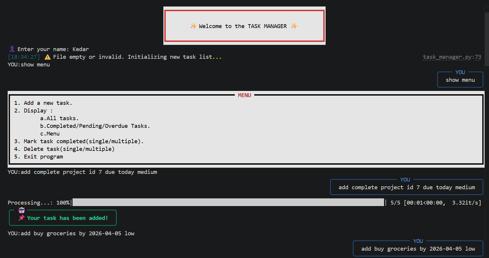
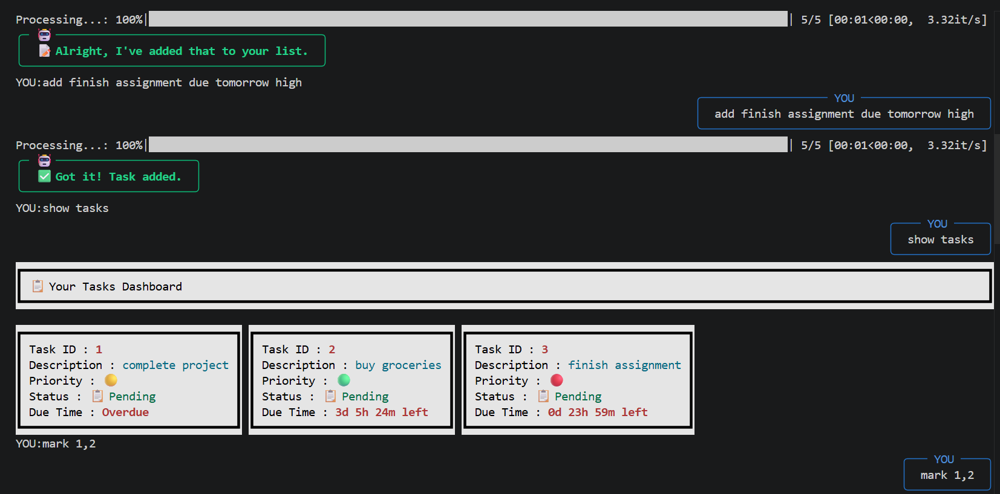
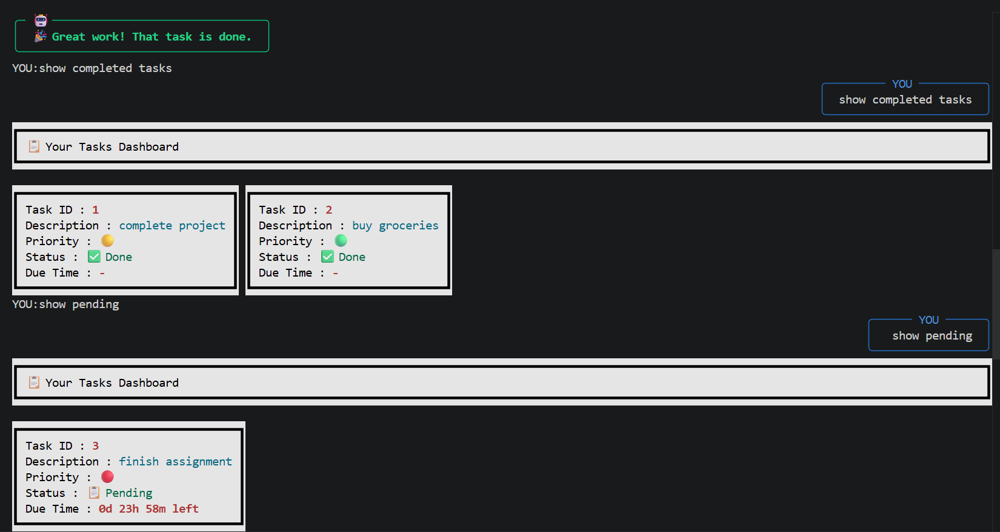
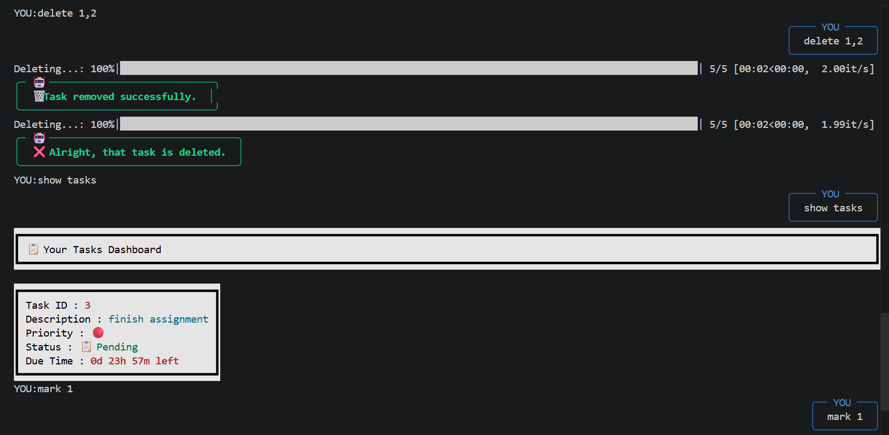
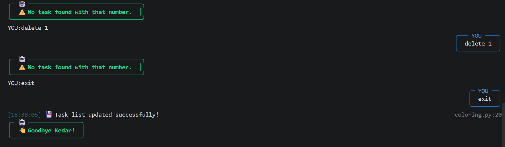

# 🗂️ Task Manager

A command-line task manager built with Python. Tasks are stored in `mytasks.json` and managed through a simple chatbot-style interface.

## 🚀 Features

- 📂 Persistent JSON storage
- 👤 Personalized greeting using the user's name
- 🤖 Natural-language style commands such as `add`, `show`, `done`, and `delete`
- 📝 Task fields for ID, description, status, due date, and priority
- 📋 Filters for all, completed, pending, and overdue tasks
- 💾 Auto-save after add, update, and delete actions

## 🧰 Requirements

- Python 3.10+
- `dateparser`
- Works on Windows, macOS, and Linux

## 📦 Installation

Install dependencies:

```bash
pip install -r requirements.txt
```

## ▶️ Run

Start the app with:

```bash
python main.py
```

You will be prompted for your name, then the app loads `mytasks.json`. If the file does not exist, it is created automatically.

## 📁 Project Files

- `main.py` - entry point and interactive loop
- `task_manager.py` - task storage and task operations
- `chatbot.py` - regex-based command parsing
- `util.py` - due date calculations
- `mytasks.json` - persisted task data

## 🤖 Chatbot Commands

The chatbot recognizes intent from text, not only fixed commands.

- 👋 Greeting: `hi`, `hello`, `hey`
- ➕ Add task: messages containing `add` or `new`
- 📋 Show tasks: `show`, `display`
- ✅ Mark complete: `mark`, `complete`, `done` with a task number
- 🗑️ Delete task: `delete`, `remove`, `erase`, `cancel` with a task number
- 👋 Exit: `exit`, `quit`, `bye`, `end`

## ➕ Add Task Format

Adding a task currently requires:

- 📝 A task description
- 📅 A due date the parser can understand
- 🏷️ An optional priority: `high`, `medium`, `low`, or `normal`
- 🔢 An optional task ID; otherwise the app assigns the next number

Examples:

```text
add finish report due tomorrow high
add buy groceries by 2026-03-15 low
add submit assignment id 7 due today medium
```

If no due date is provided, the task will not be added.

## 📋 Display Filters

The app supports these display modes through chatbot input:

- `show` or `display` - all tasks
- `show completed` - completed tasks
- `show pending` - pending tasks
- `show overdue` - overdue tasks
- `show menu` - menu output

## 💬 Demo Conversation

The chatbot uses random reply variants for greetings, add, delete, mark-complete, and error messages, so the exact wording may differ. The conversation below is a realistic sample based on the current code.







Notes about the current behavior:

- `show menu` only displays the menu when at least one task already exists.
- `show pending` also includes overdue tasks, because overdue tasks still have `Status = false`.
- The exact remaining-time text changes based on the current date and time.

## 📁 JSON Structure

Tasks are stored like this:

```json
{
  "tasks": [
    {
      "Task_No": 1,
      "Description": "Buy groceries",
      "Status": false,
      "Due_Date": "2026-03-15 18:00",
      "Priority": "symbol for selected priority"
    }
  ]
}
```

## 🛠️ Implementation Notes

- The application stores priority internally as a symbol, even though the user types `high`, `medium`, `low`, or `normal`.
- Overdue and remaining time are calculated when tasks are displayed.
- `done 1     7` and `delete 1 ,2` work because the chatbot extracts every number in the message and applies the action to each one.
- **You can delete or mark multiple tasks.**
- Some console text in the current source files shows encoding issues on some terminals, but the core functionality still runs.

## 🧠 What This Project Demonstrates

1. Object-oriented Python design
2. JSON file handling
3. Input parsing with regular expressions
4. Basic validation and persistence
5. Interactive CLI chatbot-based task management
6. Colorful CLI.
